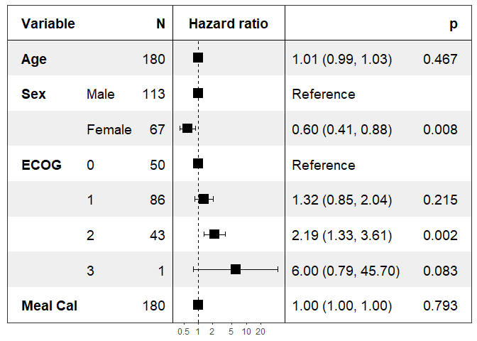

<!-- README.md is generated from README.Rmd. Please edit that file -->

# forestmodel

<!-- badges: start -->

<!-- badges: end -->

This is an R package to generate forest plots of the coefficients of
models produced by `lm`, `glm`, `survival::coxph`, etc.

The main function is `forest_model`, with a helper function
`default_forest_panels` to produce the necessary `panels` `data.frame`.

## Installation

The package can be installed using `install.packages`. It needs Hadley
Wickham’s `broom`, `dplyr`, `gpplot2` and `lazyeval` packages.

Development takes place on the github repository
<https://github.com/NikNakk/forestmodel/>.

## Installation

You can install the released version of forestmodel from
[CRAN](https://CRAN.R-project.org) with:

``` r
install.packages("forestmodel")
```

And the development version from [GitHub](https://github.com/) with:

``` r
# install.packages("devtools")
devtools::install_github("NikNakk/forestmodel")
```

## Example

``` r
library(forestmodel)
library(survival)
library(dplyr)
pretty_lung <- lung %>%
  transmute(time,
            status,
            Age = age,
            Sex = factor(sex, labels = c("Male", "Female")),
            ECOG = factor(lung$ph.ecog),
            `Meal Cal` = meal.cal)

print(forest_model(coxph(Surv(time, status) ~ ., pretty_lung)))
```


